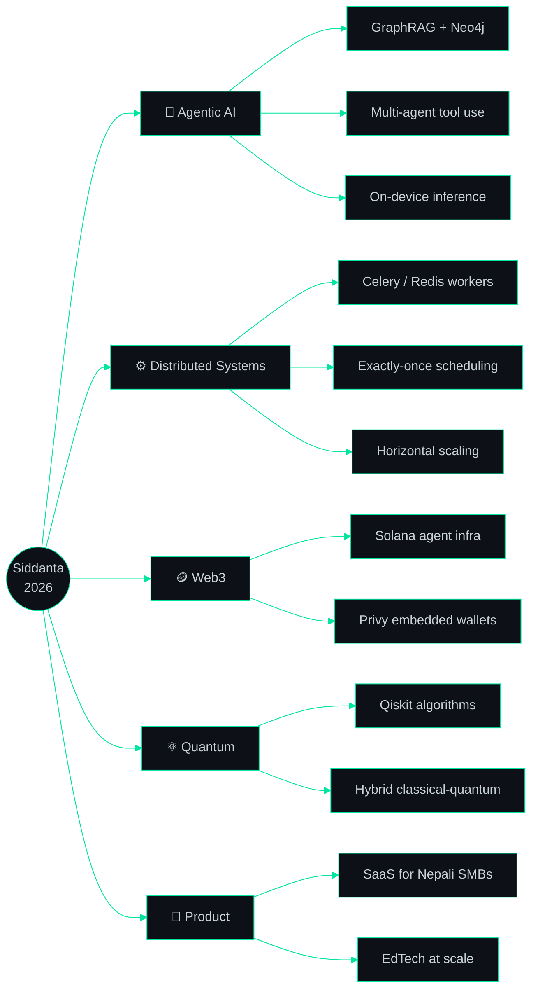

<div align="center">
  
</div>

<div align="center">
  <a href="https://www.linkedin.com/in/siddanta-sodari/">
    
  </a>
</div>

<div align="center">

[](https://www.siddantasodari.com.np/)
[](https://www.linkedin.com/in/siddanta-sodari/)
[](mailto:siddantasodari123@gmail.com)
[](https://kkkhane.com)


<a href="https://github.com/siddanta-ar1?tab=followers"></a>
<a href="https://github.com/siddanta-ar1?tab=repositories"></a>


</div>


## `~/whoami`

```ts
const siddanta = {
  role:     "Serial Tech Entrepreneur & Full-Stack / AI Systems Engineer",
  based:    "Chitwan, Nepal 🇳🇵",
  studying: "BSc.CSIT @ IOST, Tribhuvan University",
  building: ["OmX Lab", "Krixnova", "KKKhane", "NOTEacher", "Wristify", "TrXWeb", "HumanSign"],
  leading:  { BOSC: "Vice President", CodeForChange: "PR Lead" },
  stack:    ["Next.js", "TypeScript", "FastAPI", "PostgreSQL", "Redis", "Neo4j", "React Native"],
  nowOn:    ["Agentic AI systems", "GraphRAG", "Solana agent infra", "Quantum computing"],
  mantra:   "360 days. No vibe coding. Ship something real every single day.",
};
```

I build **products that go to production, take payments and stay up** — not demos. Over the last year that has meant an
IRD-compliant restaurant SaaS running live cafés, an AI tutoring platform with a distributed ingestion pipeline, a
zero-touch e-commerce fulfilment system wired into Nepal's courier network, and an offline-first heritage-conservation
app that won a national hackathon.


## `~/ventures` — What I'm Building

| Venture | Role | What it is |
| :--- | :--- | :--- |
| **[KKKhane](https://kkkhane.com)** | Product Architect & Lead Dev | Ultra-premium restaurant SaaS — QR menus, real-time KOT, POS, inventory & waste control, VAT/PAN **IRD-compliant** billing |
| **OmX Lab** | Founder | AI service + product studio; the engineering house behind KKKhane and client platforms |
| **[NOTEacher](https://noteacher.vercel.app)** | Founder | AI EdTech that turns curriculum into interactive scrollytelling — GraphRAG tutor over a real prerequisite graph |
| **Krixnova** | Founder | Digital marketing studio — built and lead a founding team of **7+** |
| **[Made In Nepal Stores](https://madeinnepalstores.com)** | Partner | E-commerce for authentic Nepali-made products, with automated logistics |
| **Wristify** | Founder | Digital-products storefront: curation, delivery systems, customer experience |
| **TrXWeb** | Founder | High-velocity web services — scalable architectures, rapid turnaround |
| **HumanSign** | Founder | Keystroke-dynamics notary: cryptographic proof of *human* authorship |
| **InoveX** | Founding Member | Community-driven innovation & tech-education initiative |
| **EcoVera Artemisia™** | Co-Founder | Agribusiness — Artemisia-based herbal product line |


## `~/stack`

<div align="center">

**Languages**


**Frontend & Mobile**


**Backend, Data & AI**


**Infra & Tooling**


</div>

<details>
<summary><b>🔎 The detail behind the icons — what I actually run in production</b></summary>

<br />

| Layer | What I use, and how |
| :--- | :--- |
| **Web** | Next.js App Router (RSC, streaming, edge), TypeScript strict, Tailwind + shadcn/ui, Framer Motion, React Three Fiber, Zod + React Hook Form |
| **APIs** | FastAPI (async), Node/Express, REST + webhooks, Resend for transactional mail, Playwright for end-to-end coverage |
| **Data** | PostgreSQL (PL/pgSQL, RLS, connection pooling), Supabase Auth/Storage/SSR, pgvector embeddings, Neo4j + Cypher for hierarchy |
| **Async** | Celery + Redis workers, Celery Beat for exactly-once distributed scheduling, task-state polling piped into the UI |
| **AI** | GraphRAG (vector + multi-hop graph traversal), document ingestion & vectorisation pipelines, on-device inference with `llama.rn` / ONNX Runtime |
| **Mobile** | Expo / React Native, expo-router, MapLibre, SQLite offline sync, camera + sensor alignment |
| **Ops** | Docker, Nginx reverse proxies with buffer tuning, DNS TTL cutovers, Vercel, GitHub Actions, VPS provisioning under fire |
| **Web3** | Solana agent workers, Privy embedded wallets, off-chain compute with on-chain execution |
| **Hardware** | QZ Tray thermal printing, barcode/QR pipelines for POS and retail |

</details>


## `~/projects` — Selected Work

<table>
<tr>
<td width="50%" valign="top">

### 🏔️ Sākṣī — Conservation Evidence
`Expo` `React Native` `MapLibre` `On-device AI` `SQLite`

Turns pilgrimage and heritage tourism into a conservation record: visitors re-shoot fixed viewpoints at Lumbini and three
Kathmandu Valley UNESCO sites, and the aligned photo pairs reach a custodian dashboard as actionable evidence. Offline-first,
with a cited-source AI that will say *"I cannot answer that."*

**🏆 National Level Hackathon Winner — LumbiniX 2026**

</td>
<td width="50%" valign="top">

### 🎓 [NOTEacher](https://noteacher.vercel.app) — AI Tutor
`Next.js` `FastAPI` `Celery` `Redis` `Neo4j` `pgvector`

Hybrid **GraphRAG**: concepts are nodes, prerequisites are edges, so the tutor traverses *Algebra → Limits → Derivatives*
instead of guessing from cosine similarity. 50 MB textbooks ingest through a non-blocking Celery pipeline that reports
live progress back to the browser.

**32+ engineering phases shipped**

</td>
</tr>
<tr>
<td width="50%" valign="top">

### 🍽️ [KKKhane](https://kkkhane.com) — Restaurant OS
`Next.js` `Supabase` `PostgreSQL` `QZ Tray`

End-to-end café & restaurant automation for Nepal: contactless QR menus, real-time Kitchen Order Tickets, POS, live
financial analytics, inventory and waste control — with **VAT/PAN billing that satisfies IRD regulations**.

</td>
<td width="50%" valign="top">

### 🔐 [UNSAID](https://github.com/siddanta-ar1/unsaid) — Private by Design
`TypeScript` `Rust` `Turborepo` `Solana`

A vault for what you can't say out loud. One invariant rules the codebase: **plaintext never crosses the backend boundary** —
enforced in CI by schema gates, log serialisers, a closed event union and a canary hunted through DB, storage and logs.

</td>
</tr>
<tr>
<td width="50%" valign="top">

### 🛒 [Made In Nepal Stores](https://madeinnepalstores.com)
`Python` `FastAPI` `PostgreSQL` `NCM API`

Zero-touch fulfilment: the moment an order is confirmed, the backend generates a courier consignment through the Nepal Can
Move API and syncs the tracking ID back — no human copy-paste anywhere in the pipeline.

</td>
<td width="50%" valign="top">

### 📡 Raksha-Net — Disaster Mesh
`BLE` `Wi-Fi Direct` `Python` `Mesh Networking`

Messaging where there is no internet: BLE discovery + Wi-Fi Direct transfer with a store-and-forward data-muling algorithm,
behind a high-contrast, low-literacy UI built for Nepali disaster contexts.

**🥇 Best Functional Prototype — Ideathon 2025**

</td>
</tr>
<tr>
<td width="50%" valign="top">

### ⌨️ HumanSign — Typing Biometrics
`Python` `ML` `Behavioural Biometrics`

Verifies *who* wrote something from the rhythm of how it was typed — keystroke dynamics as a digital notary for authorship
in an AI-generated world.

**🥉 3rd Place — CODEFEST Chitwan 2025 (Provincial)**

</td>
<td width="50%" valign="top">

### 🌐 Platforms in production
`Next.js` `Supabase` `PostgreSQL`

[ScholarsPoint](https://scholarspoint.net) · [RSGRT Institute](https://rsgrt.com.np) ·
[Techraj Digital Bazaar](https://www.techrajshop.com) · [Naari Sringaar](https://www.naarisringaar.com.np/) ·
[Inovex](https://inovex-official-website.vercel.app) · [GS Tradelink](https://gstradelink-mu.vercel.app)

Real users, real payments, real uptime.

</td>
</tr>
</table>


## `~/stats` — Live from GitHub

<div align="center">


<h4>Contribution calendar — every green square is one more day of the challenge</h4>


</div>

### 🐍 Watch the contributions get eaten

<div align="center">
  <picture>
    <source media="(prefers-color-scheme: dark)" srcset="https://raw.githubusercontent.com/siddanta-ar1/siddanta-ar1/output/github-contribution-grid-snake-dark.svg" />
    <source media="(prefers-color-scheme: light)" srcset="https://raw.githubusercontent.com/siddanta-ar1/siddanta-ar1/output/github-contribution-grid-snake.svg" />
    
  </picture>
</div>


## `~/wins`

<div align="center">

| 🏆 | Achievement | Where |
| :--: | :--- | :--- |
| 🥇 | **National Level Hackathon Winner** — project Sākṣī | LumbiniX 2026, Lumbini City College |
| 🥇 | **Best Functional Prototype** — Raksha-Net | Ideathon 2025 |
| 🥉 | **3rd Position (Provincial)** — HumanSign | CODEFEST Chitwan 2025 |
| 🎓 | **Quantum Computing Diploma** — QBronze169-473 | QWorld |
| 💰 | **IT Scholarship, NPR 50,000** | Government of Nepal |
| 📚 | **111 Days of Learning** | Code for Change |
| 🔥 | **360 Days of NON-VIBE-CODE** — day 243 and counting | Nov 18 2025 → Nov 18 2026 |

</div>


## `~/community`

<div align="center">

[](http://bosc.org.np/)
[](https://github.com/siddanta-ar1)
[](https://github.com/siddanta-ar1)
[](https://github.com/siddanta-ar1)

</div>

I run open-source literacy programs and workshops, organise community tech events with **Inovex · BOSC · Code for Change ·
CCT Club · Dreams IT Club**, and spend my Fridays building with Superteam Nepal. The goal is simple: fewer people in Nepal
should have to learn this the hard way.

<div align="center">

[](https://holopin.io/@siddantaar1)

</div>


## `~/now`



<div align="center">
  
</div>


## `~/contact`

<div align="center">

**Open to:** founding-engineer roles · AI & full-stack contracts · quantum-computing research · open-source collaboration

[](https://www.linkedin.com/in/siddanta-sodari/)
[](mailto:siddantasodari123@gmail.com)
[](https://www.siddantasodari.com.np/)
[](https://github.com/siddanta-ar1)

<br />

<i>Build. Connect. Experiment. Repeat.</i>

</div>

<div align="center">
  
</div>
